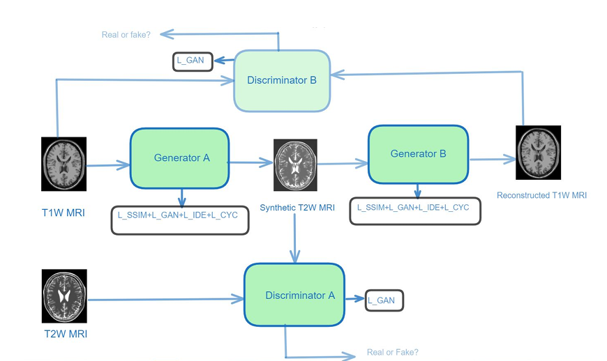
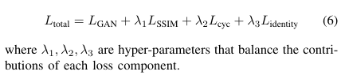

### 📄 Summary of the Paper

**Title:** _T1W MRI to T2W MRI Image Synthesis Using SSIM-CycleGAN_  
**Authors:** Meharban M. S., Sabu M. K., T. Santhanakrishnan  
**Published in:** IEEE ICACC 2024  
**DOI:** [10.1109/ICACC63692.2024.10845374](https://doi.org/10.1109/ICACC63692.2024.10845374)

---

### 🔍 Objective

The aim of the research is to generate high-quality T2-weighted (T2W) MRI images from T1-weighted (T1W) MRI images using a modified CycleGAN. 
The novelty lies in introducing the Structural Similarity Index Measure (SSIM) into the loss function to improve the perceptual and structural realism of the synthesized images. 
This is especially important in clinical settings where precise structural representation is crucial.

---

### 🧠 Methodologies and Innovations

#### ✅ 1. SSIM-CycleGAN Architecture:
A modified CycleGAN model is used with two generators and two discriminators. The generators are based on U-Net architectures and are responsible for translating T1W to T2W images and vice versa. Discriminators follow a PatchGAN configuration to evaluate the realism of image patches rather than the entire image, helping preserve fine texture.



#### ✅ 2. Loss Functions:
To better preserve image structure and quality, the following loss components are used:

- **Identity Loss:** Ensures the generator behaves like an identity function when given images from the target domain.
- **SSIM Loss:** Enforces perceptual similarity, encouraging better luminance, contrast, and structural integrity.
- **GAN Generator and Discriminator Losses:** Standard adversarial losses that drive the generator to create realistic images.
- **Cycle Consistency Loss:** Maintains that converting an image to another domain and back yields the original image.
- **Total Loss Function:** Combines all above components using weights (λ) to balance each contribution.



---

### 🧪 Data Preprocessing and Datasets

#### ⚙️ Datasets Used:
- **BraTS 2019:** Contains multi-modal brain tumor MR images, widely used for brain image synthesis and segmentation tasks.
- **IXI Dataset:** Includes T1 and T2 MR images collected from normal subjects, useful for general brain synthesis tasks.

#### 🔄 Preprocessing Steps:
Preprocessing is critical due to varying image resolutions, intensities, and orientations:
- **Normalization:** Each image is normalized using:
  ```
  normalized_image = (image - mean) / std
  ```
  This step standardizes image intensities for consistent network input.
- **Resizing:** All MR slices are resized to 256x256 pixels.
- **Data Splitting:** The dataset is split into 80% training and 20% testing.
- **Unpaired Setup:** T1W and T2W images are not necessarily from the same subject but are statistically matched.

---

### 📊 Experimental Setup

The model was trained over 250 epochs using a batch size of 16. The Adam optimizer was employed to stabilize GAN training. Image size was consistently set to 256x256.

---

### 📈 Results

#### ✨ Performance Metrics
The model's performance was evaluated using standard metrics: PSNR, MSE, MAE, and SSIM. These were computed over various samples to assess consistency.

| Metric | Sample 1 | Sample 2 | Sample 3 |
|--------|----------|----------|----------|
| PSNR  | 27.56    | 27.61    | 25.67    |
| MSE   | 0.0841   | 0.0843   | 0.0849   |
| MAE   | 0.1789   | 0.1754   | 0.1787   |
| SSIM  | 0.843    | 0.842    | 0.822    |

#### ⚖️ Comparative Evaluation:
Comparison with other GAN variants shows the superiority of SSIM-CycleGAN:

| Method             | PSNR  | MSE    | MAE    | SSIM  |
|--------------------|--------|--------|--------|--------|
| SSIM-CycleGAN      | 28.66  | 0.0841 | 0.1706 | 0.846  |
| DC-CycleGAN        | 26.61  | 0.0915 | 0.1867 | 0.814  |
| CycleGAN(ResNet)   | 23.35  | 0.0981 | 0.1902 | 0.812  |

#### 🔍 Loss Function Comparison:
Ablation study on loss functions highlights the impact of SSIM:

| Loss Function              | PSNR  | MSE    | MAE    | SSIM  |
|----------------------------|--------|--------|--------|--------|
| GAN+Cyc+SSIM+Iden (L1)     | 28.66  | 0.0841 | 0.1706 | 0.846  |
| Iden+Cyc+GAN (L2)          | 23.61  | 0.0985 | 0.2942 | 0.804  |
| SSIM+Cyc+GAN (L3)          | 27.55  | 0.0881 | 0.2367 | 0.842  |
| Cyc+GAN (L4)               | 27.52  | 0.0887 | 0.1986 | 0.842  |

---

### ⛔ Challenges Addressed

- Tackles the poor structural fidelity in traditional CycleGAN outputs.
- Avoids reliance on paired datasets, which are difficult to obtain in real clinical settings.
- Reduces blurring artifacts by incorporating perceptual losses (SSIM).

---

### ❓ Challenges Left for Future Work

- The model struggles with preserving fine-grained structures.
- Exploring transfer learning or domain adaptation to other MRI modalities.
- Possible integration with attention mechanisms to further focus on relevant anatomy.

---

### 🔬 Contributions and Clinical Impact

- Novel integration of SSIM into CycleGAN architecture for improved medical synthesis.
- Demonstrates measurable improvements over baseline models.
- May reduce the need for multiple MR imaging sequences in clinical practice, saving time and cost.

---

### 📃 Citation (IEEE Format):
```bibtex
M. M. S, S. M. K and T. Santhanakrishnan, "T1W MRI to T2W MRI Image Synthesis Using SSIM-CycleGAN," 2024 International Conference on Advances in Computing and Communications (ICACC), Kochi, India, 2024, pp. 1-6, doi: 10.1109/ICACC63692.2024.10845374.
```

---

### 🔍 Useful for:
- Medical image synthesis researchers
- GAN-based imaging developers
- Clinical applications requiring fewer imaging sessions

