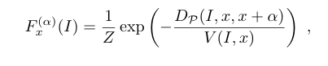
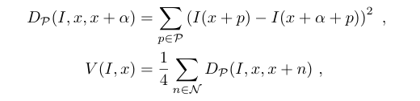
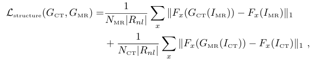
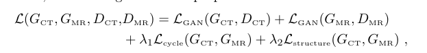

### 📄 Summary of the Paper

**Title:** _Unpaired Brain MR-to-CT Synthesis using a Structure-Constrained CycleGAN_  
**Authors:** Heran Yang, Jian Sun, Aaron Carass, Can Zhao, Junghoon Lee, Zongben Xu, Jerry Prince  
**Published in:** Proceedings of MICCAI, 2018  
**arXiv:** [1809.04536](https://arxiv.org/abs/1809.04536)

---

### 🔍 Objective

To generate structurally consistent synthetic CT images from unpaired MR images using a **Structure-Constrained CycleGAN**. The work introduces:

- A novel **structure-consistency loss** based on the **Modality Independent Neighborhood Descriptor (MIND)**
- A **position-based slice selection strategy** for better training efficiency and anatomical correspondence

---

### 🧠 Methodologies and Innovations

#### ✅ 1. CycleGAN Backbone:
Two generators (G<sub>CT</sub>, G<sub>MR</sub>) and two discriminators (D<sub>CT</sub>, D<sub>MR</sub>) to learn bidirectional mappings between CT and MR domains using unpaired data.

#### ✅ 2. Structure-Consistency Loss:
Addresses the limitation of conventional CycleGAN where structural fidelity is not enforced.

The **MIND feature** captures self-similarity in non-local patches around each voxel, invariant to modality.

**MIND feature for voxel x:**



Where:
- _Z_ = normalization constant
- _DP_ = patch distance:  
- _V(I, x)_ = local variance:



Final **Structure-Consistency Loss**:



#### ✅ 3. Training Loss:




Where:
- \( \lambda_1 = 10 \)
- \( \lambda_2 = 5 \)

#### ✅ 4. Position-Based Slice Selection:
Aligns training slices by anatomical position to improve learning stability:
```
T(i) = \left[ \frac{i \cdot (K_{CT} - 1)}{K_{MR} - 1} \right] + m
```
Where m is a random offset in [−5, 5].

---

### 📊 Experimental Setup and Results

- **Dataset:** 45 clinical brain MR and CT volumes
- **Training/Validation/Test:** 27 / 3 / 15 patients
- **Metrics Used:**
  - MAE (Mean Absolute Error)
  - PSNR (Peak Signal-to-Noise Ratio)
  - SSIM (Structural Similarity Index)
  - SSIM(HG): SSIM in high gradient regions (e.g., bone)

#### ⚡ Quantitative Results (Average over 15 test subjects):
| Method             | MAE ↓ | PSNR ↑ | SSIM ↑ | SSIM(HG) ↑ |
|--------------------|---------|----------|------------|---------------|
| CycleGAN           | 150.3   | 23.09    | 0.732      | 0.546         |
| CycleGAN (PBS)     | 147.0   | 23.29    | 0.740      | 0.592         |
| CycleGAN (paired)  | 122.7   | 24.57    | 0.785      | 0.630         |
| **Proposed Method**| **129.0** | **24.15** | **0.779**  | **0.617**     |

- Proposed model significantly outperforms vanilla CycleGAN (p < 0.001)
- Comparable to a CycleGAN trained with paired data

---

### ⛔ Challenges Addressed
- Structural inconsistencies in conventional CycleGAN-generated images
- Lack of paired data availability in clinical scenarios
- Mode collapse from random unaligned training slices

---

### ❓ Challenges Left for Future Work
- Extension to 3D volumetric GANs (this work uses 2D slices)
- Domain adaptation across scanners and populations
- Integration of attention mechanisms or multi-modal input features
- Real-time performance optimization for clinical deployment

---

### 🔬 Contributions and Clinical Impact
- First method to enforce structural similarity using a descriptor (MIND) without ground-truth segmentation
- Introduced simple yet effective training strategy (PBS)
- Can potentially reduce patient CT scans in radiotherapy planning

---

### 📃 Citation (IEEE Format):
```bibtex
H. Yang, J. Sun, A. Carass, C. Zhao, J. Lee, Z. Xu, and J. Prince, “Unpaired Brain MR-to-CT Synthesis using a Structure-Constrained CycleGAN,” in *Proc. MICCAI*, 2018. [Online]. Available: https://arxiv.org/abs/1809.04536
```

---

### 🔍 Useful for:
- Beginners in medical imaging AI
- Researchers working on image synthesis or GANs
- Developers building clinical tools for radiation planning or attenuation correction

